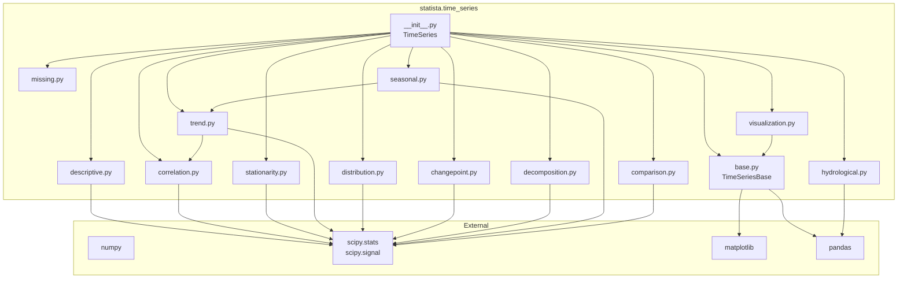
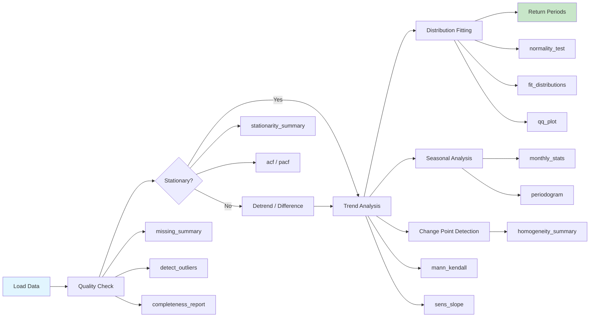
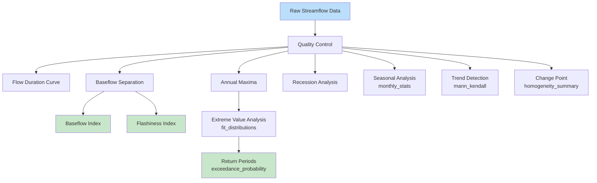

# Time Series Subpackage

The `statista.time_series` subpackage provides the `TimeSeries` class — a pandas
`DataFrame` subclass with **53 statistical analysis methods** across 12 functional
categories, designed for researchers in hydrology, climate science, and environmental
engineering.

```python
from statista.time_series import TimeSeries
```

## Architecture

`TimeSeries` is composed from 12 parent classes (mixins), each providing a specific
category of functionality. At runtime, they all merge into a single class that extends
`pandas.DataFrame`.

```mermaid
classDiagram
    class DataFrame {
        <<pandas>>
    }
    class TimeSeriesBase {
        +__init__(data, index, columns)
        +_get_ax_fig()
        +_adjust_axes_labels()
    }
    class Descriptive {
        +stats
        +extended_stats
        +l_moments()
        +summary()
    }
    class Visualization {
        +box_plot()
        +violin()
        +raincloud()
        +histogram()
        +density()
        +rolling_statistics()
    }
    class MissingData {
        +missing_summary()
        +gap_analysis()
        +completeness_report()
        +detect_outliers()
        +outlier_plot()
    }
    class Correlation {
        +acf()
        +pacf()
        +cross_correlation()
        +lag_plot()
        +correlation_matrix()
        +ljung_box()
    }
    class Stationarity {
        +adf_test()
        +kpss_test()
        +stationarity_summary()
    }
    class Trend {
        +mann_kendall()
        +sens_slope()
        +detrend()
        +innovative_trend_analysis()
    }
    class Distribution {
        +qq_plot()
        +pp_plot()
        +normality_test()
        +empirical_cdf()
        +fit_distributions()
    }
    class ChangePoint {
        +pettitt_test()
        +snht_test()
        +buishand_range_test()
        +cusum()
        +homogeneity_summary()
    }
    class Decomposition {
        +classical_decompose()
        +smooth()
        +envelope()
    }
    class Seasonal {
        +monthly_stats()
        +seasonal_subseries()
        +annual_cycle()
        +periodogram()
        +seasonal_mann_kendall()
    }
    class Hydrological {
        +flow_duration_curve()
        +annual_extremes()
        +exceedance_probability()
        +baseflow_separation()
        +baseflow_index()
        +flashiness_index()
        +recession_analysis()
    }
    class Comparison {
        +anomaly()
        +standardized_anomaly()
        +double_mass_curve()
        +regime_comparison()
    }
    class TimeSeries {
        +_constructor
    }

    DataFrame <|-- TimeSeriesBase
    TimeSeriesBase <|-- TimeSeries
    Descriptive <|-- TimeSeries
    Visualization <|-- TimeSeries
    MissingData <|-- TimeSeries
    Correlation <|-- TimeSeries
    Stationarity <|-- TimeSeries
    Trend <|-- TimeSeries
    Distribution <|-- TimeSeries
    ChangePoint <|-- TimeSeries
    Decomposition <|-- TimeSeries
    Seasonal <|-- TimeSeries
    Hydrological <|-- TimeSeries
    Comparison <|-- TimeSeries
```



## Module Dependencies

Internal cross-module imports between the time series subpackage files:



## Typical Analysis Workflow



## Hydrological Analysis Pipeline



## Method Categories

| Category | Module | Methods | Purpose |
|---|---|---|---|
| [Descriptive](descriptive.md) | `descriptive.py` | 4 | Summary statistics, L-moments |
| [Visualization](visualization.md) | `visualization.py` | 7 | Box, violin, raincloud, histogram, KDE |
| [Missing Data](missing.md) | `missing.py` | 5 | Gap analysis, outlier detection |
| [Correlation](correlation.md) | `correlation.py` | 6 | ACF, PACF, cross-correlation, Ljung-Box |
| [Stationarity](stationarity.md) | `stationarity.py` | 3 | ADF, KPSS, combined diagnosis |
| [Trend](trend.md) | `trend.py` | 4 | Mann-Kendall (5 variants), Sen's slope |
| [Distribution](distribution.md) | `distribution.py` | 5 | QQ/PP plots, normality tests |
| [Change Point](changepoint.md) | `changepoint.py` | 5 | Pettitt, SNHT, Buishand, CUSUM |
| [Decomposition](decomposition.md) | `decomposition.py` | 3 | Classical decompose, smoothing |
| [Seasonal](seasonal.md) | `seasonal.py` | 5 | Monthly stats, periodogram |
| [Hydrological](hydrological.md) | `hydrological.py` | 7 | FDC, baseflow, recession |
| [Comparison](comparison.md) | `comparison.py` | 4 | Anomaly, regime comparison |

## Quick Start

```python
import numpy as np
from statista.time_series import TimeSeries

# Create from data
data = np.loadtxt("examples/data/time_series1.txt")
ts = TimeSeries(data)

# Descriptive statistics
ts.extended_stats
ts.summary()

# Stationarity + Trend
ts.stationarity_summary()
ts.mann_kendall(method="hamed_rao")

# Distribution fitting
ts.normality_test()
ts.qq_plot()
```
